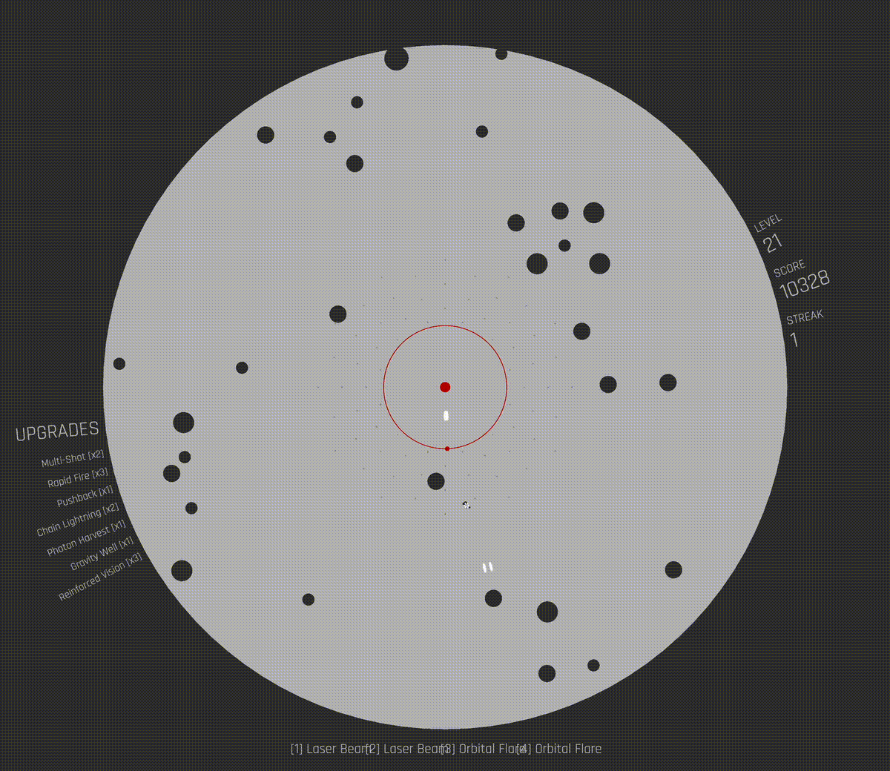

# Polaris

A minimalist radial shoot 'em up built with Phaser 3 and TypeScript.



## Game Concept

You're the red dot at the center of a circle. Enemies spawn at the edge and move toward you. Aim and shoot to survive as long as you can.

When enemies reach you, your vision shrinks. When vision hits zero it resets, but your terminal radius grows. If the terminal radius reaches the playfield edge, it's game over.

## Features

- Mouse and gamepad support
- Four difficulty modes
- Power-ups and consumable weapons
- Procedural audio (Web Audio API)
- WebGL blur shader
- Local leaderboard

## Getting Started

```bash
pnpm install
pnpm dev        # http://localhost:3000
pnpm build      # Production build
```

## License

ISC
